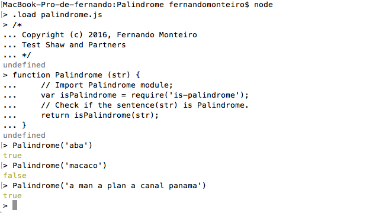

Instructions:
---

1- The test assumes that you have installed on your machine the Node.js.

If you still do not have Node.js follow the following statement:

Go to: https://nodejs.org/en/download/, download and install the compatible version with your system.

2- Install Dependencies:

Open your shell and type:

	npm install

3- To run the program you should open your shell on `Palindrome folder ` and type:

	node

Now let's load the file in memory:    

	.load Palindrome.js

4- The search is made through the text you want to compare if is Palindrome or not using the Palindrome function, as shown below.

	Polindrome("aba")

> the function's Return `true`

5- For a better implementation we can add the messages on our Terminal/Shell:

* is a palindrome
* is not a palindrome

Example:

	isPalindrome(str);
	if (isPalindrome() === true) {
		return "is a palindrome"
	} else {
		return "is not a palindrome"
	}

The following image, illustrate the result on Terminal window:

